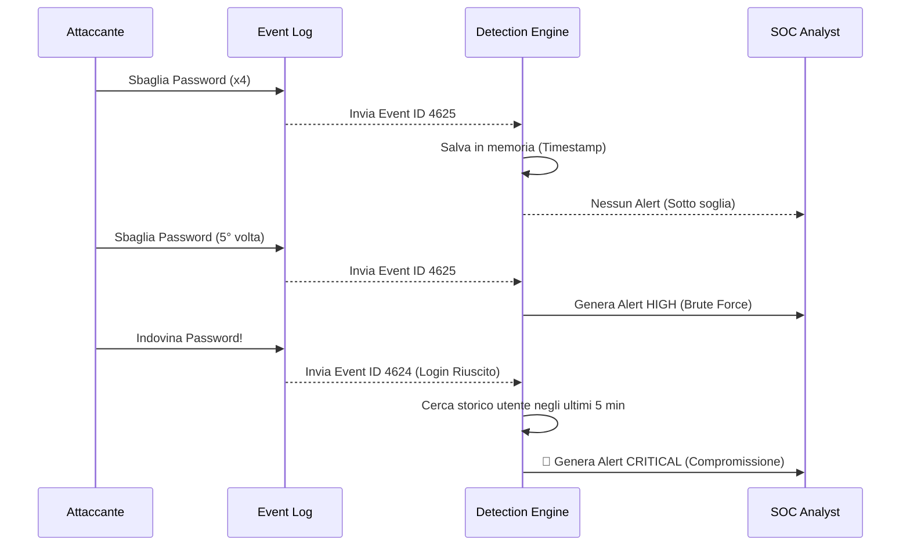
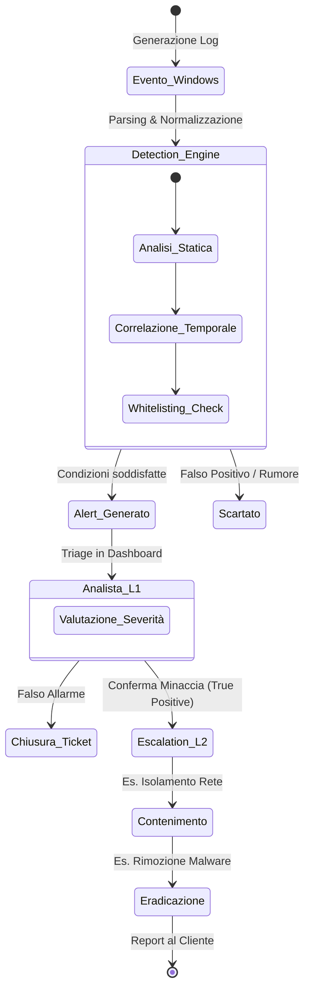

# 🛡️ Advanced Python SIEM: Threat Detection & Correlation Engine


## 🎯 Panoramica del Progetto
Questo progetto è un **Mini-SIEM (Security Information and Event Management)** sviluppato in Python. A differenza dei classici parser di log, questo sistema non si limita a leggere righe di testo, ma implementa un vero e proprio **motore di correlazione (Stateful Detection)** e logiche di analisi basate su **finestre temporali (Sliding Windows)**.

Il progetto è stato sviluppato per dimostrare competenze pratiche operative tipiche di un **SOC Analyst (L1/L2)**, passando dalla pura teoria all'implementazione tecnica delle regole di rilevamento.

---

## 🧠 Core Features & Logica di Detection

Questo SIEM supera i rilevamenti statici implementando tre concetti chiave delle Security Operations:

1. **Stateful Event Correlation (Correlazione di Stato):**
   - Il sistema mantiene in memoria lo storico delle azioni degli utenti (`defaultdict`). 
   - Se un utente genera l'Event ID `4625` (Login Fallito) molteplici volte, e successivamente genera l'Event ID `4624` (Login Riuscito), il sistema eleva automaticamente l'allarme a **CRITICAL**, segnalando una sospetta compromissione dell'account (Brute Force andato a buon fine).

2. **Sliding Time Windows (Finestre Temporali):**
   - Gli attacchi Brute Force non vengono rilevati su un conteggio assoluto, ma all'interno di una finestra temporale specifica (es. 5 tentativi in 5 minuti). I tentativi più vecchi vengono scartati automaticamente, abbattendo drasticamente i Falsi Positivi causati da utenti sbadati durante la giornata.

3. **False Positive Reduction & Whitelisting:**
   - La detection dei processi sospetti (Event ID `4688`) monitora binari critici (es. `powershell.exe`). Tuttavia, per evitare l'alert fatigue, il motore controlla il `path` di esecuzione: se PowerShell viene eseguito dalle directory legittime (es. `System32`), l'evento viene scartato. Viene flaggato solo se eseguito da percorsi anomali (es. `C:\Users\Public\`).


### 🔍 Esempio Logico: Rilevamento Compromissione (Brute Force Success)

Il seguente diagramma illustra come il SIEM correla eventi separati nel tempo per confermare un'intrusione reale, scartando i tentativi isolati.



### 🦠 Esempio di Detection: Malware Process Tree (Living Off The Land)

Il motore analizza la catena di esecuzione (Parent-Child Process) per identificare comportamenti anomali, come file Office che lanciano shell di sistema, tipici di attacchi macro/ransomware.

```mermaid
graph TD
    subgraph "Utente Ingannato"
        A[outlook.exe] -->|Apre allegato| B[Fattura_Scaduta.doc]
    end

    subgraph "Esecuzione Nascosta - Invisibile all'utente"
        B -->|Esegue Macro VBA| C{winword.exe}
        C -->|Genera processo figlio| D[cmd.exe]
        D -->|Bypass Execution Policy| E[powershell.exe -enc ZWNoby...]
    end

    subgraph "Azione Malevola"
        E -->|Download Payload| F((Malware.exe))
        E -->|Modifica Registro| G[(Chiave Run - Persistenza)]
    end

    classDef normal fill:#1a365d,stroke:#00a2ff,stroke-width:2px;
    classDef warning fill:#5c4000,stroke:#ffaa00,stroke-width:2px;
    classDef critical fill:#5e1919,stroke:#ff0000,stroke-width:2px;

    class A,B normal;
    class C,D warning;
    class E,F,G critical;
```


---

## ⚙️ Architettura del Sistema

L'architettura è modulare e simula un ambiente Enterprise suddiviso in tre componenti:

```mermaid
graph TD
    subgraph Red Team / Attaccante
        A[log_simulator.py] -->|Inietta Log JSON| B(events.json)
    end

    subgraph SOC Detection Engine
        B -->|Legge Log Real-Time| C{detection.py}
        C -->|Sliding Window Check| D[Filtro Falsi Positivi]
        C -->|Stateful Analysis| E[Motore di Correlazione]
        D --> F[(alerts.json)]
        E --> F
    end

    subgraph Triage / Analyst View
        F -->|Fetch Dati| G[app.py - Flask Server]
        G -->|Render| H((Dashboard Web GUI))
    end

    classDef red fill:#5e1919,stroke:#ff0000,stroke-width:2px;
    classDef blue fill:#1a365d,stroke:#00a2ff,stroke-width:2px;
    classDef green fill:#124a2f,stroke:#00ff66,stroke-width:2px;
    
    class A red;
    class C,D,E blue;
    class H green;
```



### ⏱️ Timeline dell'Incidente (Funzionamento del log_simulator.py)

Rappresentazione cronologica della catena di attacco simulata e rilevata in tempo reale dal SIEM.

```mermaid
%%{init: {'theme':'dark'}}%%
gantt
    title Attack Lifecycle & SIEM Detection
    dateFormat  HH:mm:ss
    axisFormat  %H:%M:%S

    section Recon & Access
    Rumore di fondo (Login fallito singolo) :done, 10:00:00, 1s
    Brute Force Attack (5 tentativi)       :done, 10:05:00, 5s
    Login Riuscito (Compromissione)        :crit, 10:05:05, 2s

    section Execution
    Ricognizione interna (whoami)          :10:06:00, 3s
    Esecuzione PowerShell Sospetto         :crit, 10:06:15, 5s

    section SIEM Response
    Triage Alert (HIGH) - Brute Force      :milestone, 10:05:05, 0s
    Triage Alert (CRITICAL) - Compromise   :milestone, 10:05:07, 0s
    Triage Alert (CRITICAL) - LOLBin Use   :milestone, 10:06:16, 0s
```



1. **Il Simulatore:** Inietta log JSON formattati per simulare il rumore di fondo e attacchi mirati.
2. **Il Detection Engine:** Un demone sempre in ascolto che analizza i log, applica le regole matematiche e temporali, e genera gli allarmi.
3. **La Dashboard Web:** Un'interfaccia grafica per il triage in tempo reale con livelli di severità (`MEDIUM`, `HIGH`, `CRITICAL`).

---

## 🚀 Come testare la Demo (Guida all'uso)

Per vedere il SIEM in azione (e le regole di correlazione), è necessario aprire 3 terminali separati.

**1. Avvia il Motore SIEM:**
Questo avvierà il demone che ascolta i nuovi eventi in entrata.
```bash
python main.py
```

**2. Avvia la Dashboard (Analista SOC):**
Questo avvierà l'interfaccia web. Apri il browser su `http://127.0.0.1:5000`.
```bash
python app.py
```

**3. Lancia l'attacco simulato (Red Team):**
Questo script inietterà rumore di fondo, un attacco brute force, una compromissione correlata e l'esecuzione di un malware.
```bash
python log_simulator.py
```
*Immediatamente, osserverai la Dashboard web aggiornarsi automaticamente mostrando il triage degli attacchi.*

---

## 📸 Screenshot della Dashboard
*(Spazio per la foto)*

---

## 🛡️ Mappatura MITRE ATT&CK®

Il Detection Engine è stato mappato sul framework globale MITRE per garantire la copertura delle tattiche più comuni:

| Tactic | Technique ID | Technique Name | Detection Logic nel SIEM | Severity |
| :--- | :---: | :--- | :--- | :---: |
| 🔑 **Credential Access** | `T1110` | Brute Force | Monitoraggio soglie *Event ID 4625* (Sliding Window 5 min) | 🟠 HIGH |
| 🔓 **Initial Access** | `T1078` | Valid Accounts | Correlazione *4625 -> 4624* (Tentativi falliti seguiti da successo) | 🔴 CRIT |
| ⚙️ **Execution** | `T1059.001` | PowerShell | *Event ID 4688* + Regex su parametri (es. `-enc`) | 🔴 CRIT |
| 🥷 **Defense Evasion** | `T1036` | Masquerading | Analisi Path di esecuzione vs LOLBins (Whitelisting System32) | 🟡 MED |
---
### 📖 SOC Incident Response Workflow

Il sistema è pensato per integrarsi in un classico flusso di risposta agli incidenti (Playbook L1/L2), riducendo l'Alert Fatigue e velocizzando il triage.


---

*Progetto realizzato per dimostrare competenze pratiche in ambito Log Analysis, SIEM Architecture e Incident Detection.*
