### 🦠 Esempio di Detection: Malware Process Tree (Living Off The Land)

Il motore analizza la catena di esecuzione (Parent-Child Process) per identificare comportamenti anomali, come file Office che lanciano shell di sistema, tipici di attacchi macro/ransomware.

```mermaid
graph TD
    subgraph "Utente Ingannato"
        A[outlook.exe] -->|Apre allegato| B[Fattura_Scaduta.doc]
    end

    subgraph "Esecuzione Nascosta - Invisibile all'utente"
        B -->|Esegue Macro VBA| C{winword.exe}
        C -->|Genera processo figlio| D[cmd.exe]
        D -->|Bypass Execution Policy| E[powershell.exe -enc ZWNoby...]
    end

    subgraph "Azione Malevola"
        E -->|Download Payload| F((Malware.exe))
        E -->|Modifica Registro| G[(Chiave Run - Persistenza)]
    end

    classDef normal fill:#1a365d,stroke:#00a2ff,stroke-width:2px;
    classDef warning fill:#5c4000,stroke:#ffaa00,stroke-width:2px;
    classDef critical fill:#5e1919,stroke:#ff0000,stroke-width:2px;

    class A,B normal;
    class C,D warning;
    class E,F,G critical;
```

---
### ⏱️ Timeline dell'Attacco (Simulato, ma basato su eventi reali)

Rappresentazione cronologica della catena di attacco simulata e rilevata in tempo reale dal SIEM.

```mermaid
gantt
    title Attack Lifecycle & SIEM Detection
    dateFormat  HH:mm:ss
    axisFormat  %H:%M:%S

    section Recon & Access
    Rumore di fondo (Login fallito singolo) :done, 10:00:00, 1s
    Brute Force Attack (5 tentativi)       :done, 10:05:00, 5s
    Login Riuscito (Compromissione)        :crit, 10:05:05, 2s

    section Execution
    Ricognizione interna (whoami)          :10:06:00, 3s
    Esecuzione PowerShell Sospetto         :crit, 10:06:15, 5s

    section SIEM Response
    Triage Alert (HIGH) - Brute Force      :milestone, 10:05:05, 0s
    Triage Alert (CRITICAL) - Compromise   :milestone, 10:05:07, 0s
    Triage Alert (CRITICAL) - LOLBin Use   :milestone, 10:06:16, 0s
```

